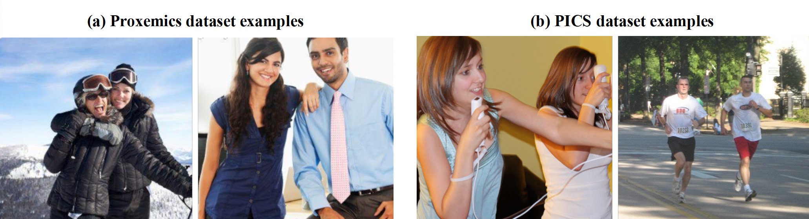
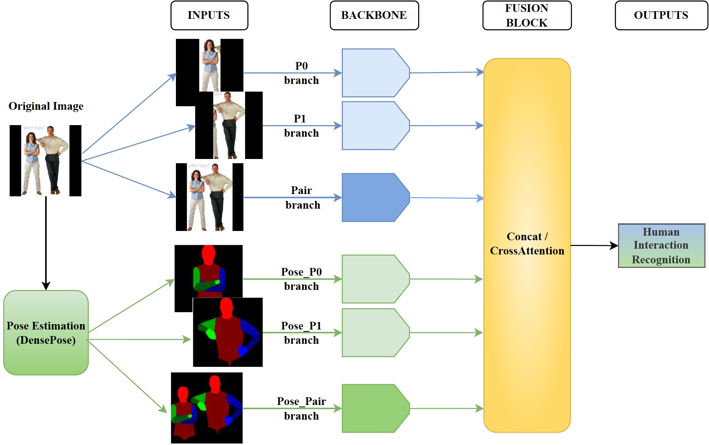

# Proxemics-net++: classification of human interactions in still images


<div align="center">

   :page_facing_up: [Paper](https://link.springer.com/article/10.1007/s10044-024-01270-3) &nbsp; | &nbsp; []() 

</div>


&nbsp;


<p align="center">
    
</p>
<p align="center">
    <sub><strong>Figure 1: Examples of human-human interactions.</strong> These images illustrate the great complexity inherent in the problem of recognizing human interactions in images. The images in (a) highlight situations where it is confusing to determine the type of physical contact (hand-elbow, hand-shoulder, elbow-shoulder, etc.) due to clothing and partial occlusion. In (b), the images show ambiguity in determining the type of social relationship between individuals (family, friends, co-workers, etc.) without additional context.</sub>
</p>

&nbsp;

Human interaction recognition (HIR) is a significant challenge in computer vision that focuses on identifying human interactions in images and videos. HIR presents a great complexity due to factors such as pose diversity, varying scene conditions, or the presence of multiple individuals. Recent research has explored different approaches to address it, with an increasing emphasis on human pose estimation. In this work, we propose Proxemics-Net++, an extension of the Proxemics-Net model, capable of addressing the problem of recognizing human interactions in images through two different tasks: the identification of the types of “touch codes” or proxemics and the identification of the type of social relationship between pairs. To achieve this, we use RGB and body pose information together with the state-of-the-art deep learning architecture, ConvNeXt, as the backbone. We performed an ablative analysis to understand how the combination of RGB and body pose information affects these two tasks. Experimental results show that body pose information contributes significantly to proxemic recognition (first task) as it allows to improve the existing state of the art, while its contribution in the classification of social relations (second task) is limited due to the ambiguity of labelling in this problem, resulting in RGB information being more influential in this task.

&nbsp;
<p align="center">
    
</p>
<p align="center">
    <sub><strong>Figure 2: Our Proxemics-Net++ model.</strong>  It consists of six inputs: three branches for the RGB information of the couple and the individuals that compose it (blue branches) and another three branches for the body pose representation of the two individuals and the couple (green branches).
        All branches have the same type of backbone (Base or Large). The outputs of these six branches are passed to a Fusion Block, which can be of two types: Concatenation fusion or CrossAttention fusion. Finally, the type of human interaction (proxemics or social relationship) of the input samples is predicted.</sub>
</p>


&nbsp;

### :chart_with_upwards_trend: Comparison to the State of the Art - Proxemics dataset
<div align="center">
   
  | **Model**                                                   | **HH** | **HS** | **SS** | **HT** | **HE** | **ES** | **mAP (a)** | **mAP (b)** |
   |------------------------------------------------------------|--------|--------|--------|--------|--------|--------|--------------|--------------|
   | [Yang et al.](https://doi.org/10.1109/CVPR.2012.6248095)                       | 37     | 29     | 50     | 61     | 38     | 34     | 42           | 38           |
   | [Chu et al.](https://doi.org/10.1109/ICCV.2015.383)                                | 41.2   | 35.4   | 62.2   | -      | 43.9   | 55     | -            | 46.6         |
   | [Jiang et al.](https://doi.org/10.1109/CVPR.2017.366)                               | 59.7   | 52     | 53.9   | 33.2   | 36.1   | 36.2   | 45.2         | 47.5         |
   | [Li W. et al.](https://link.springer.com/chapter/10.1007/978-3-030-58555-6_2)                              | 56.7   | 55.1   | 52.8   | 78.4   | 65.0   | 65.5   | 62.3         | 59.1         |
   | [Sousa et al.](https://doi.org/10.1016/j.cviu.2023.103785)                            | 66.2   | 55.1   | 69.5   | 78.8   | 65.6   | 68.1   | 67.2         | 64.9         |
   | [Jiménez et al.](https://doi.org/10.1007/978-3-031-36616-1_32)                   | 62.4   | 56.7   | 62.4   | **86.4**| 68.8  | 67.9   | 67.4         | 63.8         |
   | **Our ConvNeXt_Base (CrossAttention) - (RGB+Pose - Full Model)**                               | **71.5**| **63.2**| **80.5**| 80.7  | **75.6**| **71.3**| **73.8**    | **72.4**     |

</div>

<p align="center">
<sub><strong>Table 1:</strong> Comparison of our best model obtained on the <strong>Proxemics dataset</strong> with the state of the art</sub>
</p>
&nbsp;

In this Table, two values of %mAP are compared: mAP(a) is the value of mAP explained in the previous sections (the mean of the AP values of the six types of proxemics) and mAP(b) is the mean of the AP values but excluding the Hand-Torso (HT) class as done in Chu et al.

The comparison shows that our best model (RGB+Pose with individual and pair branches, Base variant, and CrossAttention Fusion Block) achieves the highest %mAP results across almost all proxemics types, outperforming existing methods with significant improvements of 6.4% (mAP(a)) and 7.5% (mAP(b)). These results show that our combination of RGB and pose data, alongside a deep learning model like ConvNeXt, significantly enhances performance for proxemics recognition.

&nbsp;

### :chart_with_upwards_trend: Comparison to the State of the Art - PISC dataset
<div align="center">
   
| **Model**                                      | **Friends** | **Family** | **Couple** | **Prof.** | **Comm.** | **No Rel.** | **mAP** |
|------------------------------------------------|-------------|------------|------------|-----------|------------|-------------|---------|
| [Li J. et al.](https://doi.org/10.1007/s11263-020-01295-1)                    | 60.6        | 64.9       | 54.7       | 82.2      | 58         | 70.6        | 65.2    |
| [Zhang et al.](https://doi.org/10.1109/ICME.2019.00279)                       | 64.6        | 67.8       | 60.5       | 76.8      | 34.7       | 70.4        | 70.0    |
| [Goel et al.](https://doi.org/10.1109/CVPR.2019.01144)                         | -           | -          | -          | -         | -          | -           | 71.6    |
| [Li W. et al.](https://link.springer.com/chapter/10.1007/978-3-030-58555-6_2)                          | 60.8        | 65.9       | **84.8**   | 73.0      | 51.7       | 70.4        | 72.7    |
| [Li L. et al.](https://doi.org/10.1007/s00371-021-02244-w)                          | **82.2**    | 39.4       | 33.2       | 60.0      | 47.7       | 71.8        | 73.3    |
| [Yang et al.](https://doi.org/10.1109/ACCESS.2021.3096553)                      | 63.1        | 73.5       | 78.3       | **82.7**  | **76.8**   | 71.8        | 73.6    |
| [Sousa et al.](https://doi.org/10.1016/j.cviu.2023.103785)                         | 49.4        | 70.5       | 74.6       | 76.5      | 59.6       | 74.6        | **75.2** |
| **Our ConvNeXt_Base (Concat) (RGB - Full model)** | 56.2        | **83.9**   | 77.6       | 61.0      | 59.0       | **82.9**    | 70.1    |
</div>

<p align="center">
<sub><strong>Table 2:</strong> Comparison of our best model obtained on the <strong>PISC dataset</strong> with the state of the art</sub>
</p>
&nbsp;

Table 2 compares our best model with existing state-of-the-art approaches for social interaction recognition. Although our model (RGB model with individual and pairs branches, Base variant, and Concatenation Fusion Block) performs best in the "Family" and "No Relation" categories, it doesn't surpass the current best overall (70.1% mAP vs. 75.2% mAP).

Notably, most other methods rely on graph-based architectures, unlike ours, which uses a deep neural network. Compared with the PISC authors' deep neural network approach (Li J. et al.), we achieve better results (70.1% mAP vs 65.2% mAP), showing that RGB data combined with ConvNeXt architecture enhances social interaction recognition. However, recent trends in graph-based architectures suggest that this problem requires models focused on relationships due to its complexity.


&nbsp;

---


&nbsp;
## :rocket: What's new?

- `base_model_main/`: Main directory for the base model.
- `dataset/`: Directory containing the code necessary for dataset preprocessing - RGB and Pose.
- `ìmgs/`: Directory containing the some images of this work
- `base_model_main/`: Main directory for the full model - RGB / Pose / RGB+Pose models.
- `test/`: Directory containing code and resources related to model testing.
- `train/`: Directory containing code and resources related to model training.
- `requirements_proxemicsNet.txt`: File specifying the necessary dependencies for the project.
- `requirements_retinaFace_detectron_densepose.txt`: File specifying the necessary dependencies to obtain the pose maps of the images - Using RetinaFace and DensePose

&nbsp;


## :star2: Quick Start
###  :black_small_square: Installing Dependencies

Install the necessary dependencies to run this project, you can use the following command:

    conda create --name <env> --file requirements_proxemicsNet.txt

Install the necessary dependencies to obtain the Pose maps from the images (in case of not using the datasets already provided or using new images):

    conda create --name <env> --file requirements_retinaFace_detectron_densepose.txt


###  :black_small_square: Download and unzipping the Preprocessed Datasets ZIP

To use the pre-processed datasets, you must first download and unzip the files. You can use the following command:

    unzip dataset_proxemics.zip 
    unzip dataset_pisc.zip 


###  :black_small_square: Downloading the pre-trained ConvNeXt models

To use the pre-trained ConvNeXt models that we have selected as a backbone to train our Proxemics-Net++ models, you need to download them from the following locations:

- Pre-trained Base model: [Download here](https://dl.fbaipublicfiles.com/convnext/convnext_base_22k_224.pth) (350MB)
- Pre-trained Large model: [Download here](https://dl.fbaipublicfiles.com/convnext/convnext_large_22k_224.pth) (800MB)

Once downloaded, you need to unzip them and place them one level above, i.e., in ../premodels/.

&nbsp;
## :star2: Training a New Model - RGB / Pose / RGB+Pose

To train and test a new model (Proxemcis or PISC), you should access the `rgb_pose_model_main` directory and execute the following command lines depending on the type of model you want to train:
- #### For RGB models 
  * Full Model (3 Branches)
      
         python3 rgb_pose_model_main_convNext.py --datasetDIR <DIR dataset/> --outModelsDIR <DIR where you'll save the model> --modeltype <base/large> --b <batchsize> --set <set1/set2> --lr <learningRate> --datasetName <proxemics/pisc> --rgb

  * Only Pair RGB
 
         python3 rgb_pose_model_main_convNext.py --datasetDIR <DIR dataset/> --outModelsDIR <DIR where you'll save the model> --modeltype <base/large> --b <batchsize> --set <set1/set2> --lr <learningRate> --datasetName <proxemics/pisc> --rgb --onlyPairRGB

- #### For Pose models 

  * Full Model (3 Branches)
 
         python3 rgb_pose_model_main_convNext.py --datasetDIR <DIR dataset/> --outModelsDIR <DIR where you'll save the model> --modeltype <base/large> --b <batchsize> --set <set1/set2> --lr <learningRate> --datasetName <proxemics/pisc>  --pose

  * Only Pair RGB

         python3 rgb_pose_model_main_convNext.py --datasetDIR <DIR dataset/> --outModelsDIR <DIR where you'll save the model> --modeltype <base/large> --b <batchsize> --set <set1/set2> --lr <learningRate> --datasetName <proxemics/pisc>  --pose --onlyPairPose

- #### For RGB+Pose models 

  * Full Model (6 Branches)
 
         python3 rgb_pose_model_main_convNext.py --datasetDIR <DIR dataset/> --outModelsDIR <DIR where you'll save the model> --modeltype <base/large> --b <batchsize> --set <set1/set2> --lr <learningRate> --datasetName <proxemics/pisc>  --rgb --pose  

  * RGB+Pose (Only Pair RGB)

         python3 rgb_pose_model_main_convNext.py --datasetDIR <DIR dataset/> --outModelsDIR <DIR where you'll save the model> --modeltype <base/large> --b <batchsize> --set <set1/set2> --lr <learningRate> --datasetName <proxemics/pisc>  --rgb --pose --onlyPairRGB

  * RGB+Pose (Only Pair Pose)

         python3 rgb_pose_model_main_convNext.py --datasetDIR <DIR dataset/> --outModelsDIR <DIR where you'll save the model> --modeltype <base/large> --b <batchsize> --set <set1/set2> --lr <learningRate> --datasetName <proxemics/pisc>  --rgb --pose --onlyPairPose

  * RGB+Pose (Only Pair RGB + Only Pair Pose)

         python3 rgb_pose_model_main_convNext.py --datasetDIR <DIR dataset/> --outModelsDIR <DIR where you'll save the model> --modeltype <base/large> --b <batchsize> --set <set1/set2> --lr <learningRate> --datasetName <proxemics/pisc>  --rgb --pose --onlyPairRGB --onlyPairPose


Be sure to adjust the values between <...> with the specific paths and configurations required for your project.

**Note:** The model is trained with Concatenation Fusion by default. To use CrossAttention, just add **`—-crossAttention`** to your command line.

&nbsp;
## :star2: Inference - Download the best Proxemics-Net++ model we have trained for each dataset.
Here are 2 of the best Proxemics-Net++ models we have trained.

   - ### Proxemics dataset
      * A model with ConvNeXt Base as the backbone. This model has given the best results (see Table 1 - SOTA). It has been trained with RGB and Pose information of individuals and pairs (Full model - 6 branches). In addition, it uses the CrossAttention fusion. [Download here]() (4.45GB)
   - ### PISC dataset
      * A model with ConvNeXt Base as the backbone. This model has given the best results (see Table 2 - SOTA). It has been trained with RGB information of individuals and pairs (Full model - 3 branches). In addition, it uses Concatenation fusion. [Download here](https://ucordoba-my.sharepoint.com/:u:/g/personal/i72jivem_uco_es/EeXBJyE-2DRKkHBqkWLFe4EBC3s69F8cnMvQQFmAVwjNug?e=CkpVKK) (1.13GB)

   
   :star_struck: **You can test these models in the Google Colab Demo we have prepared for you.** []() 

&nbsp;

## :memo: Citing Proxemics-Net
If you find Proxemics-Net++ useful in your work, please consider citing the following BibTeX entry:
```bibtex
@article{Jimenez2024,
  author    = {I. Jiménez-Velasco and J. Zafra-Palma and R. Muñoz-Salinas and others},
  title     = {Proxemics-net++: classification of human interactions in still images},
  journal   = {Pattern Analysis and Applications},
  volume    = {27},
  number    = {1},
  pages     = {49},
  year      = {2024},
  doi       = {10.1007/s10044-024-01270-3}
}

